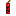
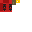
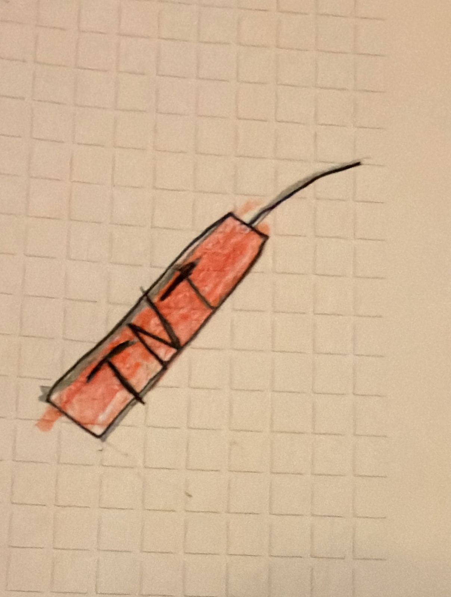

# TNT Arremessavel





## Resumo

A TNT Arremessavel e uma granada explosiva que o jogador pode arremessar. Ao atingir um bloco ou entidade, cria uma explosao com knockback. O dano e muito maior quando atinge uma entidade diretamente (25 de dano direto + explosao raio 3) versus atingir um bloco (explosao raio 2).

---

## Dados do item

| Propriedade | Valor |
|-------------|-------|
| Identificador do item | `escavadora:tnt_arremessavel` |
| Identificador da entidade | `escavadora:tnt_arremessavel` |
| Categoria no menu | Items > Arrow |
| Stack maximo | 16 |
| Forca de lancamento | 1.2 (escala e maximo) |
| Animacao ao arremessar | Sim (`do_swing_animation: true`) |
| Textura do item | `textures/items/tnt_arremessavel` |
| Nome pt_BR | "TNT Arremessavel" |
| Nome en_US | "Throwable TNT" |

---

## Arquivo: item JSON completo

**Caminho:** `Super Picareta BP/items/tnt_arremessavel.item.json`

```json
{
    "format_version": "1.21.10",
    "minecraft:item": {
        "description": {
            "identifier": "escavadora:tnt_arremessavel",
            "menu_category": {
                "category": "items",
                "group": "itemGroup.name.arrow"
            }
        },
        "components": {
            "minecraft:max_stack_size": 16,
            "minecraft:throwable": {
                "do_swing_animation": true,
                "launch_power_scale": 1.2,
                "max_launch_power": 1.2
            },
            "minecraft:projectile": {
                "projectile_entity": "escavadora:tnt_arremessavel"
            },
            "minecraft:icon": {
                "textures": {
                    "default": "tnt_arremessavel"
                }
            },
            "minecraft:display_name": {
                "value": "item.escavadora:tnt_arremessavel.name"
            }
        }
    }
}
```

### Explicacao dos componentes

- **`minecraft:throwable`**: Permite que o item seja arremessado com clique direito. `launch_power_scale` e `max_launch_power` controlam a velocidade do projetil (1.2 = 20% mais rapido que padrao).
- **`minecraft:projectile`**: Ao arremessar, o jogo spawna a entidade `escavadora:tnt_arremessavel` como projetil.

---

## Entidade projetil (Behavior Pack)

**Caminho:** `Super Picareta BP/entities/tnt_arremessavel.entity.json`

```json
{
    "format_version": "1.16.0",
    "minecraft:entity": {
        "description": {
            "identifier": "escavadora:tnt_arremessavel",
            "is_spawnable": false,
            "is_summonable": true,
            "runtime_identifier": "minecraft:snowball"
        },
        "components": {
            "minecraft:collision_box": {
                "width": 0.25,
                "height": 0.25
            },
            "minecraft:projectile": {
                "on_hit": {
                    "stick_in_ground": { "shake_time": 0 }
                },
                "power": 1.0,
                "gravity": 0.05,
                "angle_offset": 0,
                "hit_sound": "glass"
            },
            "minecraft:physics": {},
            "minecraft:pushable": {
                "is_pushable": true,
                "is_pushable_by_piston": true
            },
            "minecraft:conditional_bandwidth_optimization": {
                "default_values": {
                    "max_optimized_distance": 80,
                    "max_dropped_ticks": 10,
                    "use_motion_prediction_hints": true
                }
            }
        }
    }
}
```

### Detalhes da entidade

| Propriedade | Valor | Explicacao |
|-------------|-------|------------|
| runtime_identifier | `minecraft:snowball` | Herda comportamento de projetil da snowball |
| collision_box | 0.25 x 0.25 | Hitbox pequena (projetil) |
| on_hit | `stick_in_ground` | Ao atingir algo, gruda no lugar (o script explode antes) |
| gravity | 0.05 | Gravidade moderada (cai em arco) |
| power | 1.0 | Velocidade base do projetil |
| hit_sound | `glass` | Som de vidro ao impactar |
| is_spawnable | false | NAO aparece no ovo de spawn |
| is_summonable | true | Pode ser invocado por /summon |

---

## Visual da entidade (Resource Pack)

### Entidade cliente

**Caminho:** `Super Picareta RP/entity/tnt_arremessavel.entity.json`

```json
{
    "format_version": "1.10.0",
    "minecraft:client_entity": {
        "description": {
            "identifier": "escavadora:tnt_arremessavel",
            "materials": {
                "default": "entity_alphatest"
            },
            "textures": {
                "default": "textures/entity/tnt_arremessavel"
            },
            "geometry": {
                "default": "geometry.tnt_arremessavel"
            },
            "render_controllers": [
                "controller.render.tnt_arremessavel"
            ],
            "animations": {
                "spin": "animation.tnt_arremessavel.spin"
            },
            "scripts": {
                "animate": [
                    "spin"
                ]
            }
        }
    }
}
```

- **Material:** `entity_alphatest` — suporta transparencia binaria (pixels totalmente transparentes ou opacos)
- **Animacao:** `spin` — roda continuamente enquanto voa

### Modelo 3D (geometry)

**Caminho:** `Super Picareta RP/models/entity/tnt_arremessavel.geo.json`

```json
{
    "format_version": "1.12.0",
    "minecraft:geometry": [
        {
            "description": {
                "identifier": "geometry.tnt_arremessavel",
                "texture_width": 32,
                "texture_height": 32,
                "visible_bounds_width": 1,
                "visible_bounds_height": 1,
                "visible_bounds_offset": [0, 0.25, 0]
            },
            "bones": [
                {
                    "name": "root",
                    "pivot": [0, 0, 0]
                },
                {
                    "name": "body",
                    "parent": "root",
                    "pivot": [0, 4, 0],
                    "cubes": [
                        {
                            "origin": [-1.5, 0, -1.5],
                            "size": [3, 8, 3],
                            "uv": [0, 0]
                        }
                    ]
                },
                {
                    "name": "body_rotated",
                    "parent": "root",
                    "pivot": [0, 4, 0],
                    "rotation": [0, 45, 0],
                    "cubes": [
                        {
                            "origin": [-1.5, 0, -1.5],
                            "size": [3, 8, 3],
                            "uv": [0, 0]
                        }
                    ]
                },
                {
                    "name": "fuse",
                    "parent": "root",
                    "pivot": [0, 8, 0],
                    "rotation": [0, 0, 15],
                    "cubes": [
                        {
                            "origin": [-0.5, 8, -0.5],
                            "size": [1, 3, 1],
                            "uv": [12, 0]
                        }
                    ]
                },
                {
                    "name": "fuse_tip",
                    "parent": "fuse",
                    "pivot": [0, 11, 0],
                    "cubes": [
                        {
                            "origin": [-0.5, 11, -0.5],
                            "size": [1, 1, 1],
                            "uv": [16, 0]
                        }
                    ]
                }
            ]
        }
    ]
}
```

**Estrutura do modelo:**
- **root**: Pivot central (ponto de rotacao)
- **body**: Cilindro principal 3x8x3 pixels — corpo da TNT
- **body_rotated**: Mesmo cubo rotacionado 45 graus — cria aparencia octogonal
- **fuse**: Pavio (1x3x1) inclinado 15 graus, saindo do topo
- **fuse_tip**: Ponta do pavio (1x1x1) no topo do fuse

### Animacao

**Caminho:** `Super Picareta RP/animations/tnt_arremessavel.animation.json`

```json
{
    "format_version": "1.8.0",
    "animations": {
        "animation.tnt_arremessavel.spin": {
            "loop": true,
            "animation_length": 1.0,
            "bones": {
                "root": {
                    "rotation": {
                        "0.0": [0, 0, 0],
                        "1.0": [360, 0, 360]
                    }
                }
            }
        }
    }
}
```

- **Duracao:** 1 segundo por ciclo
- **Loop:** Sim (gira continuamente)
- **Rotacao:** 360 graus em X e Z simultaneamente (giro diagonal), criando efeito de tumble

### Render controller

**Caminho:** `Super Picareta RP/render_controllers/tnt_arremessavel.render_controllers.json`

```json
{
    "format_version": "1.10.0",
    "render_controllers": {
        "controller.render.tnt_arremessavel": {
            "geometry": "geometry.default",
            "materials": [{ "*": "material.default" }],
            "textures": ["texture.default"]
        }
    }
}
```

### Attachable (como aparece na mao)

**Caminho:** `Super Picareta RP/attachables/tnt_arremessavel.json`

```json
{
    "format_version": "1.10.0",
    "minecraft:attachable": {
        "description": {
            "identifier": "escavadora:tnt_arremessavel",
            "materials": { "default": "entity_alphatest" },
            "textures": { "default": "textures/entity/tnt_arremessavel" },
            "geometry": { "default": "geometry.tnt_arremessavel" },
            "render_controllers": ["controller.render.tnt_arremessavel"]
        }
    }
}
```

---

## Comportamento via Script

**Arquivo:** `Super Picareta BP/scripts/main.js` (linhas 129-232)

### Sistema anti-explosao dupla

```javascript
const explodedTNTs = new Set();
```

Antes de explodir, o script verifica se o ID da entidade ja esta no Set. Se sim, ignora. Isso previne que o mesmo projetil exploda duas vezes (evento de bloco + evento de entidade podem ambos disparar).

Apos a explosao, o ID e removido do Set apos 10 ticks (0.5 segundo):
```javascript
system.runTimeout(() => explodedTNTs.delete(entityId), 10);
```

### Funcao principal: `explodeTNT(projectile, location, dimension, isEntityHit, hitEntity)`

#### Quando atinge um BLOCO

| Propriedade | Valor |
|-------------|-------|
| Raio de explosao | **2 blocos** |
| Raio de knockback | **6 blocos** |
| Knockback horizontal | **5.0** |
| Knockback vertical | **2.0** |
| Quebra blocos? | Sim (`breaksBlocks: true`) |
| Causa fogo? | Nao (`causesFire: false`) |
| Dano direto | Nenhum (apenas dano da explosao) |

#### Quando atinge uma ENTIDADE

| Propriedade | Valor |
|-------------|-------|
| Raio de explosao | **3 blocos** (50% maior) |
| Raio de knockback | **8 blocos** (33% maior) |
| Knockback horizontal | **8.0** (60% mais forte) |
| Knockback vertical | **3.5** (75% mais forte) |
| Quebra blocos? | Sim (`breaksBlocks: true`) |
| Causa fogo? | Nao (`causesFire: false`) |
| Dano direto na entidade | **25 de dano** (causa: entityExplosion) |

> **Nota:** O knockback e aplicado ANTES da explosao. Isso e intencional — se a explosao matasse entidades primeiro, elas nao receberiam knockback.

### Tabela comparativa

| Caracteristica | Hit em Bloco | Hit em Entidade |
|----------------|-------------|-----------------|
| Raio de explosao | 2 | 3 |
| Raio de knockback | 6 | 8 |
| Knockback horizontal | 5.0 | 8.0 |
| Knockback vertical | 2.0 | 3.5 |
| Dano direto | 0 | 25 |
| Quebra blocos | Sim | Sim |
| Fogo | Nao | Nao |

### Sistema de knockback

Funcao auxiliar: `applyExplosionKnockback(dimension, center, radius, horizontalStrength, verticalStrength)`

1. Busca todas as entidades num raio ao redor do centro da explosao
2. Para cada entidade:
   - Calcula direcao normalizada do centro ate a entidade
   - Se a entidade esta muito perto (< 0.1 bloco), usa direcao aleatoria
   - Fator de distancia: `1 - (distancia / raio)` — mais perto = mais forte
   - Fator minimo: 0.3 (mesmo no limite do raio, recebe 30% do knockback)
   - Aplica `entity.applyKnockback(normX, normZ, horizontal, vertical)`

### Eventos monitorados

1. **`projectileHitBlock`** — Quando o projetil atinge um bloco
2. **`projectileHitEntity`** — Quando o projetil atinge uma entidade (mob, jogador, animal)

### Sistema de fallback

Se nenhum dos eventos acima disparar (bug raro do Bedrock), o script tem um monitor:

```javascript
system.runInterval(() => { ... }, 2); // A cada 2 ticks
```

- Varre TODAS as 3 dimensoes (overworld, nether, the_end) procurando entidades TNT
- Se uma TNT existir ha mais de 5 ticks sem ter explodido, forca a explosao
- Rastreia `tntSpawnTick` (Map: entityId -> tick de spawn)
- Limpa entradas orfas de entidades que nao existem mais

### Constantes numericas completas

```
explodedTNTs cleanup timeout: 10 ticks (0.5s)
Fallback monitor interval:    2 ticks
Fallback threshold:            5 ticks
TNT gravity (entity):         0.05
TNT power (entity):           1.0
Launch power (item):          1.2
Stack maximo:                  16
```

---

## Arquivos relacionados

| Arquivo | Funcao |
|---------|--------|
| `Super Picareta BP/items/tnt_arremessavel.item.json` | Definicao do item |
| `Super Picareta BP/entities/tnt_arremessavel.entity.json` | Entidade projetil (servidor) |
| `Super Picareta BP/scripts/main.js` (L129-232) | Logica de explosao |
| `Super Picareta RP/entity/tnt_arremessavel.entity.json` | Visual da entidade (cliente) |
| `Super Picareta RP/models/entity/tnt_arremessavel.geo.json` | Modelo 3D |
| `Super Picareta RP/animations/tnt_arremessavel.animation.json` | Animacao de rotacao |
| `Super Picareta RP/render_controllers/tnt_arremessavel.render_controllers.json` | Render controller |
| `Super Picareta RP/attachables/tnt_arremessavel.json` | Visual na mao do jogador |
| `Super Picareta RP/textures/items/tnt_arremessavel.png` | Textura no inventario |
| `Super Picareta RP/textures/entity/tnt_arremessavel.png` | Textura da entidade 3D |
