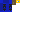

# Bomba Submarina




## Resumo

A Bomba Submarina e um explosivo projetado para uso subaquatico. No Minecraft, explosoes normais (TNT, Creeper) nao quebram blocos dentro d'agua — a agua absorve o dano. A Bomba Submarina contorna isso com um sistema de **quebra manual de blocos em esfera**, devastando estruturas subaquaticas. Em terra, funciona como uma granada fraca.

---

## Dados do item

| Propriedade | Valor |
|-------------|-------|
| Identificador do item | `escavadora:bomba_submarina` |
| Identificador da entidade | `escavadora:bomba_submarina` |
| Categoria no menu | Items > Arrow |
| Stack maximo | 16 |
| Forca de lancamento | 1.2 (escala e maximo) |
| Animacao ao arremessar | Sim (`do_swing_animation: true`) |
| Textura do item | `textures/items/bomba_submarina` |
| Nome pt_BR | "Bomba Submarina" |
| Nome en_US | "Submarine Bomb" |

---

## Arquivo: item JSON completo

**Caminho:** `Super Picareta BP/items/bomba_submarina.item.json`

```json
{
    "format_version": "1.21.10",
    "minecraft:item": {
        "description": {
            "identifier": "escavadora:bomba_submarina",
            "menu_category": {
                "category": "items",
                "group": "itemGroup.name.arrow"
            }
        },
        "components": {
            "minecraft:max_stack_size": 16,
            "minecraft:throwable": {
                "do_swing_animation": true,
                "launch_power_scale": 1.2,
                "max_launch_power": 1.2
            },
            "minecraft:projectile": {
                "projectile_entity": "escavadora:bomba_submarina"
            },
            "minecraft:icon": {
                "textures": {
                    "default": "bomba_submarina"
                }
            },
            "minecraft:display_name": {
                "value": "item.escavadora:bomba_submarina.name"
            }
        }
    }
}
```

---

## Entidade projetil (Behavior Pack)

**Caminho:** `Super Picareta BP/entities/bomba_submarina.entity.json`

```json
{
    "format_version": "1.16.0",
    "minecraft:entity": {
        "description": {
            "identifier": "escavadora:bomba_submarina",
            "is_spawnable": false,
            "is_summonable": true,
            "runtime_identifier": "minecraft:arrow"
        },
        "components": {
            "minecraft:collision_box": {
                "width": 0.25,
                "height": 0.25
            },
            "minecraft:projectile": {
                "on_hit": {
                    "stick_in_ground": { "shake_time": 0 }
                },
                "power": 1.0,
                "gravity": 0.05,
                "angle_offset": 0,
                "hit_sound": "glass"
            },
            "minecraft:physics": {},
            "minecraft:pushable": {
                "is_pushable": true,
                "is_pushable_by_piston": true
            },
            "minecraft:conditional_bandwidth_optimization": {
                "default_values": {
                    "max_optimized_distance": 80,
                    "max_dropped_ticks": 10,
                    "use_motion_prediction_hints": true
                }
            }
        }
    }
}
```

### Detalhes da entidade

| Propriedade | Valor | Explicacao |
|-------------|-------|------------|
| runtime_identifier | `minecraft:arrow` | Herda comportamento de flecha (diferente da TNT que usa snowball) |
| on_hit | `stick_in_ground` | Gruda no lugar ao atingir (o script explode via deteccao de velocidade) |
| gravity | 0.05 | Mesma gravidade da TNT |
| is_pushable | true | Pode ser empurrada por entidades e pistons |

> **Diferenca importante:** A bomba usa `minecraft:arrow` como runtime_identifier, NAO `minecraft:snowball`. Isso significa que ela se comporta como flecha quando interage com agua (afunda mais lentamente, permitindo detectar agua).

---

## Visual da entidade (Resource Pack)

### Entidade cliente

**Caminho:** `Super Picareta RP/entity/bomba_submarina.entity.json`

```json
{
    "format_version": "1.10.0",
    "minecraft:client_entity": {
        "description": {
            "identifier": "escavadora:bomba_submarina",
            "materials": { "default": "entity_alphatest" },
            "textures": { "default": "textures/entity/bomba_submarina" },
            "geometry": { "default": "geometry.tnt_arremessavel" },
            "render_controllers": ["controller.render.tnt_arremessavel"],
            "animations": { "spin": "animation.tnt_arremessavel.spin" },
            "scripts": { "animate": ["spin"] }
        }
    }
}
```

> **Nota:** A bomba REUTILIZA o modelo 3D e animacao da TNT (`geometry.tnt_arremessavel` e `animation.tnt_arremessavel.spin`), mas com sua propria textura (`textures/entity/bomba_submarina`). Isso faz a bomba ter o mesmo formato cilindrico da TNT, mas com cores/aparencia diferentes.

### Attachable

**Caminho:** `Super Picareta RP/attachables/bomba_submarina.json`

```json
{
    "format_version": "1.10.0",
    "minecraft:attachable": {
        "description": {
            "identifier": "escavadora:bomba_submarina",
            "materials": { "default": "entity_alphatest" },
            "textures": { "default": "textures/entity/bomba_submarina" },
            "geometry": { "default": "geometry.tnt_arremessavel" },
            "render_controllers": ["controller.render.tnt_arremessavel"]
        }
    }
}
```

---

## Comportamento via Script

**Arquivo:** `Super Picareta BP/scripts/main.js` (linhas 234-389)

### Como funciona (visao geral)

A Bomba Submarina NAO usa eventos de `projectileHitBlock` ou `projectileHitEntity`. Em vez disso, usa um **monitor de velocidade** que roda a cada 2 ticks:

1. Bomba e arremessada → entidade spawna
2. Monitor rastreia posicao a cada 2 ticks
3. Calcula velocidade comparando posicao atual com a anterior
4. Quando a velocidade cai abaixo de 0.05 blocos/tick → bomba "parou"
5. Verifica se parou na agua ou em terra
6. Explode com mecanica apropriada

### Sistema de deteccao de velocidade

```javascript
const submarineData = new Map(); // id -> { spawnTick, lastX, lastY, lastZ }
```

A cada 2 ticks:
1. Registra posicao atual da entidade
2. Calcula deslocamento: `dx = loc.x - data.lastX` (idem para Y e Z)
3. Calcula velocidade: `speed = Math.sqrt(dx*dx + dy*dy + dz*dz)`
4. Atualiza posicao salva para o proximo ciclo
5. **Se speed > 0.05**: Ainda em movimento, continua monitorando
6. **Se speed <= 0.05**: Parou! Verifica ambiente e explode

### Grace period

| Parametro | Valor | Explicacao |
|-----------|-------|------------|
| Grace period | 10 ticks (0.5s) | Periodo apos spawn onde a bomba NAO explode |

Isso evita que a bomba exploda imediatamente nos pes do jogador. Durante o grace period, a posicao e atualizada mas nenhuma verificacao de velocidade e feita.

### Safety timeout

| Parametro | Valor | Explicacao |
|-----------|-------|------------|
| Timeout | 200 ticks (10s) | Se a bomba estiver se movendo ha mais de 10s, forca explosao |

Previne bombas que ficam flutuando infinitamente em correntes d'agua.

### Sistema anti-explosao dupla

```javascript
const explodedSubmarines = new Set();
```

Mesmo sistema da TNT — verifica se o ID ja foi processado antes de explodir.

---

## Explosao na agua vs em terra

### Na AGUA: `explodeSubmarineWater(entity, dimension, location)`

| Propriedade | Valor |
|-------------|-------|
| Raio de knockback | **6 blocos** |
| Knockback horizontal | **5.0** |
| Knockback vertical | **2.0** |
| Raio de explosao (visual/dano) | **4 blocos** |
| Explosao quebra blocos? | **Nao** (`breaksBlocks: false` — agua absorve) |
| Quebra manual de blocos | **Sim — raio de 5 blocos** |
| Blocos protegidos | bedrock, air, water, flowing_water |
| Fogo | Nao |

A explosao visual (`createExplosion`) com `breaksBlocks: false` cria o som, particulas e dano em entidades. A quebra de blocos e feita manualmente pela funcao `breakBlocksInSphere`.

### Em TERRA: `explodeSubmarineLand(entity, dimension, location)`

| Propriedade | Valor |
|-------------|-------|
| Raio de knockback | **4 blocos** |
| Knockback horizontal | **3.0** |
| Knockback vertical | **1.0** |
| Raio de explosao | **1.5 blocos** |
| Explosao quebra blocos? | **Sim** (`breaksBlocks: true`) |
| Fogo | Nao |

Em terra, a bomba e intencionalmente fraca — e projetada para ser usada na agua.

### Tabela comparativa

| Caracteristica | Na Agua | Em Terra |
|----------------|---------|----------|
| Knockback radius | 6 | 4 |
| Knockback horizontal | 5.0 | 3.0 |
| Knockback vertical | 2.0 | 1.0 |
| Raio de explosao | 4 | 1.5 |
| Metodo de quebra | Manual (esfera) | Normal (explosion) |
| Raio de quebra | **5 blocos** | **1.5 blocos** |
| Dano a entidades | Da explosao | Da explosao |
| Efeito visual | Grande | Pequeno |

### Funcao `breakBlocksInSphere(dimension, center, radius)`

Esta funcao e a chave do poder subaquatico da bomba:

1. Calcula raio inteiro: `r = Math.ceil(radius)` = 5
2. Itera todos os blocos num cubo de -5 a +5 em X, Y e Z
3. Para cada bloco, calcula distancia ao centro: `sqrt(dx² + dy² + dz²)`
4. Se distancia > raio, pula
5. Se bloco e bedrock, air, water ou flowing_water, pula
6. Caso contrario, substitui por air

Isso cria uma cratera esferica perfeita de raio 5 blocos debaixo d'agua.

---

## Deteccao de ambiente (agua vs terra)

```javascript
const blockAtPos = dim.getBlock({ x: blockX, y: blockY, z: blockZ });
const blockId = blockAtPos.typeId;
const isInWater = blockId === "minecraft:water" || blockId === "minecraft:flowing_water";
```

Verifica o bloco na posicao EXATA da entidade (arredondado para baixo com `Math.floor`).

---

## Constantes numericas completas

```
// Timing
Grace period:              10 ticks (0.5s)
Movement threshold:        0.05 blocos/tick
Safety timeout:            200 ticks (10s)
Monitor interval:          2 ticks
Anti-dupla cleanup:        10 ticks (via runTimeout)
Stale data cleanup:        entidades mortas removidas a cada ciclo
Max exploded set size:     50 (limpa quando excede)

// Explosao na agua
Knockback radius agua:     6 blocos
Knockback horizontal:      5.0
Knockback vertical:        2.0
Explosion radius visual:   4 blocos
Block break radius:        5 blocos (manual)

// Explosao em terra
Knockback radius terra:    4 blocos
Knockback horizontal:      3.0
Knockback vertical:        1.0
Explosion radius:          1.5 blocos

// Entidade
Gravity:                   0.05
Power:                     1.0
Launch power (item):       1.2
Stack maximo:              16
```

---

## Arquivos relacionados

| Arquivo | Funcao |
|---------|--------|
| `Super Picareta BP/items/bomba_submarina.item.json` | Definicao do item |
| `Super Picareta BP/entities/bomba_submarina.entity.json` | Entidade projetil (servidor) |
| `Super Picareta BP/scripts/main.js` (L63-127) | Funcoes auxiliares (knockback, breakBlocks) |
| `Super Picareta BP/scripts/main.js` (L234-389) | Logica da bomba |
| `Super Picareta RP/entity/bomba_submarina.entity.json` | Visual da entidade (cliente) |
| `Super Picareta RP/models/entity/tnt_arremessavel.geo.json` | Modelo 3D (reutilizado da TNT) |
| `Super Picareta RP/animations/tnt_arremessavel.animation.json` | Animacao de rotacao (reutilizada) |
| `Super Picareta RP/render_controllers/tnt_arremessavel.render_controllers.json` | Render controller (reutilizado) |
| `Super Picareta RP/attachables/bomba_submarina.json` | Visual na mao do jogador |
| `Super Picareta RP/textures/items/bomba_submarina.png` | Textura no inventario |
| `Super Picareta RP/textures/entity/bomba_submarina.png` | Textura da entidade 3D |
