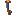
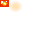

# Pistola Sinalizadora (Flare Gun)





## Resumo

A Pistola Sinalizadora dispara um projetil luminoso que utiliza uma **arquitetura hibrida** para maxima performance e estabilidade:

- **Movimento**: Controlado nativamente pelo Minecraft (fisica, gravidade, colisoes).
- **Iluminacao e Logica**: Controlados por script atraves de snapshots discretos (por bloco).

O projetil quica ate 2 vezes antes de pousar. Durante o voo, deixa um rastro de faiscas e ilumina dinamicamente o ambiente. Ao pousar, cria uma esfera de luz com raio de 7 blocos e uma coluna de fumaca, podendo incendiar blocos e entidades proximas.

O sistema envolve:
- 1 item (a pistola)
- 1 entidade projetil (o sinalizador)
- Sistema de bounce por respawn de entidade com tabela de excecoes
- Iluminacao dinamica replace-in-place com `minecraft:light_block`
- Particulas de faiscas em voo e fumaca no pouso
- Mecanica de fogo em blocos e entidades
- Configuracao centralizada em `FLARE_CONFIG`

---

## Dados do item

| Propriedade | Valor |
|-------------|-------|
| Identificador do item | `escavadora:pistola_sinalizadora` |
| Identificador da entidade projetil | `escavadora:sinalizador_projetil` |
| Categoria no menu | Items > Arrow |
| Stack maximo | 16 |
| Forca de lancamento | 1.0 (menor que TNT/Bomba que usam 1.2) |
| Animacao ao arremessar | Sim |
| Textura do item | `textures/items/pistola_sinalizadora` |
| Nome pt_BR | "Pistola Sinalizadora" |
| Nome en_US | "Flare Gun" |

---

## Arquivo: item JSON completo

**Caminho:** `Super Picareta BP/items/pistola_sinalizadora.item.json`

```json
{
    "format_version": "1.21.10",
    "minecraft:item": {
        "description": {
            "identifier": "escavadora:pistola_sinalizadora",
            "menu_category": {
                "category": "items",
                "group": "itemGroup.name.arrow"
            }
        },
        "components": {
            "minecraft:max_stack_size": 16,
            "minecraft:throwable": {
                "do_swing_animation": true,
                "launch_power_scale": 1.0,
                "max_launch_power": 1.0
            },
            "minecraft:projectile": {
                "projectile_entity": "escavadora:sinalizador_projetil"
            },
            "minecraft:icon": {
                "textures": {
                    "default": "pistola_sinalizadora"
                }
            },
            "minecraft:display_name": {
                "value": "item.escavadora:pistola_sinalizadora.name"
            }
        }
    }
}
```

> **Nota:** `launch_power_scale` e 1.0 (nao 1.2 como TNT/Bomba), resultando em trajetoria mais lenta e arco mais pronunciado.

---

## Entidade projetil (Behavior Pack)

**Caminho:** `Super Picareta BP/entities/sinalizador_projetil.entity.json`

```json
{
    "format_version": "1.16.0",
    "minecraft:entity": {
        "description": {
            "identifier": "escavadora:sinalizador_projetil",
            "is_spawnable": false,
            "is_summonable": true,
            "runtime_identifier": "minecraft:arrow"
        },
        "components": {
            "minecraft:collision_box": {
                "width": 0.25,
                "height": 0.25
            },
            "minecraft:projectile": {
                "on_hit": {
                    "remove_on_hit": {}
                },
                "power": 1.0,
                "gravity": 0.03,
                "angle_offset": 0,
                "hit_sound": "firework.blast"
            },
            "minecraft:physics": {},
            "minecraft:pushable": {
                "is_pushable": false,
                "is_pushable_by_piston": false
            },
            "minecraft:conditional_bandwidth_optimization": {
                "default_values": {
                    "max_optimized_distance": 80,
                    "max_dropped_ticks": 10,
                    "use_motion_prediction_hints": true
                }
            }
        }
    }
}
```

### Diferencas criticas em relacao aos outros projeteis

| Propriedade | Sinalizador | TNT | Bomba |
|-------------|-------------|-----|-------|
| runtime_identifier | minecraft:arrow | minecraft:snowball | minecraft:arrow |
| on_hit | **remove_on_hit** | stick_in_ground | stick_in_ground |
| gravity | **0.03** (leve) | 0.05 | 0.05 |
| is_pushable | **false** | true | true |
| hit_sound | **firework.blast** | glass | glass |

- **`remove_on_hit`**: A entidade e DESTRUIDA pelo motor do jogo ao atingir algo. O script captura o evento `projectileHitBlock` ANTES da destruicao e pode spawnar uma nova entidade para simular o bounce.
- **Gravidade 0.03**: Muito mais leve que os outros (0.05), criando arcos mais longos e voo mais suave.
- **Nao empurravel**: O projetil nao pode ser desviado por entidades ou pistons.

---

## Visual da entidade (Resource Pack)

### Entidade cliente do projetil

**Caminho:** `Super Picareta RP/entity/sinalizador_projetil.entity.json`

```json
{
    "format_version": "1.10.0",
    "minecraft:client_entity": {
        "description": {
            "identifier": "escavadora:sinalizador_projetil",
            "materials": {
                "default": "entity_emissive_alpha"
            },
            "textures": {
                "default": "textures/entity/sinalizador_projetil"
            },
            "geometry": {
                "default": "geometry.sinalizador_projetil"
            },
            "render_controllers": [
                "controller.render.sinalizador_projetil"
            ],
            "animations": {
                "pulse": "animation.sinalizador_projetil.pulse"
            },
            "scripts": {
                "animate": [
                    "pulse"
                ]
            }
        }
    }
}
```

> **Material `entity_emissive_alpha`**: Faz a entidade brilhar — ela emite luz propria, visivel mesmo no escuro.

### Modelo 3D do projetil

**Caminho:** `Super Picareta RP/models/entity/sinalizador_projetil.geo.json`

```json
{
    "format_version": "1.12.0",
    "minecraft:geometry": [
        {
            "description": {
                "identifier": "geometry.sinalizador_projetil",
                "texture_width": 32,
                "texture_height": 32,
                "visible_bounds_width": 1,
                "visible_bounds_height": 1,
                "visible_bounds_offset": [0, 0.25, 0]
            },
            "bones": [
                { "name": "root", "pivot": [0, 0, 0] },
                {
                    "name": "ball_core",
                    "parent": "root",
                    "pivot": [0, 1, 0],
                    "cubes": [{ "origin": [-1, 0, -1], "size": [2, 2, 2], "uv": [0, 0] }]
                },
                {
                    "name": "ball_ring1",
                    "parent": "root",
                    "pivot": [0, 1, 0],
                    "rotation": [0, 45, 0],
                    "cubes": [{ "origin": [-1, 0, -1], "size": [2, 2, 2], "uv": [0, 0] }]
                },
                {
                    "name": "ball_ring2",
                    "parent": "root",
                    "pivot": [0, 1, 0],
                    "rotation": [45, 0, 0],
                    "cubes": [{ "origin": [-1, 0, -1], "size": [2, 2, 2], "uv": [0, 0] }]
                },
                {
                    "name": "glow_shell",
                    "parent": "root",
                    "pivot": [0, 1, 0],
                    "rotation": [0, 22.5, 45],
                    "cubes": [{
                        "origin": [-1.5, -0.5, -1.5],
                        "size": [3, 3, 3],
                        "uv": [8, 0],
                        "inflate": 0.25
                    }]
                }
            ]
        }
    ]
}
```

**Estrutura do modelo:**
- **ball_core**: Cubo central 2x2x2 — nucleo da bola de luz
- **ball_ring1**: Mesmo cubo rotacionado 45 graus em Y — cria aparencia esferica
- **ball_ring2**: Mesmo cubo rotacionado 45 graus em X — terceira camada da esfera
- **glow_shell**: Cubo externo 3x3x3 inflado +0.25, rotacionado em Y e Z — "aura" ao redor da bola

O resultado visual e uma esfera brilhante com uma aura pulsante.

### Modelo 3D da pistola (na mao)

**Caminho:** `Super Picareta RP/models/entity/pistola_sinalizadora.geo.json`

```json
{
    "format_version": "1.12.0",
    "minecraft:geometry": [
        {
            "description": {
                "identifier": "geometry.pistola_sinalizadora",
                "texture_width": 16,
                "texture_height": 16,
                "visible_bounds_width": 2,
                "visible_bounds_height": 2,
                "visible_bounds_offset": [0, 0.5, 0]
            },
            "bones": [
                { "name": "root", "pivot": [0, 0, 0] },
                {
                    "name": "barrel",
                    "parent": "root",
                    "pivot": [0, 4, 0],
                    "cubes": [{ "origin": [-1, 3, -1], "size": [2, 8, 2], "uv": [0, 0] }]
                },
                {
                    "name": "barrel_wide",
                    "parent": "barrel",
                    "pivot": [0, 10, 0],
                    "cubes": [{ "origin": [-1.5, 10, -1.5], "size": [3, 2, 3], "uv": [0, 10] }]
                },
                {
                    "name": "grip",
                    "parent": "root",
                    "pivot": [0, 3, 0],
                    "rotation": [15, 0, 0],
                    "cubes": [{ "origin": [-1, -2, -1], "size": [2, 5, 2], "uv": [8, 0] }]
                },
                {
                    "name": "trigger_guard",
                    "parent": "root",
                    "pivot": [0, 2, 0],
                    "cubes": [{ "origin": [-0.5, 1, 0.5], "size": [1, 2, 1], "uv": [8, 7] }]
                },
                {
                    "name": "flare_loaded",
                    "parent": "barrel_wide",
                    "pivot": [0, 12, 0],
                    "cubes": [{ "origin": [-1, 12, -1], "size": [2, 2, 2], "uv": [0, 0], "inflate": 0.25 }]
                }
            ]
        }
    ]
}
```

**Estrutura do modelo da pistola:**
- **barrel**: Cano fino (2x8x2) — corpo principal
- **barrel_wide**: Boca do cano mais larga (3x2x3) no topo
- **grip**: Cabo (2x5x2) inclinado 15 graus para frente
- **trigger_guard**: Guarda do gatilho (1x2x1)
- **flare_loaded**: Sinalizador carregado no topo (2x2x2 inflado) — visivel na mao

### Animacao do projetil

**Caminho:** `Super Picareta RP/animations/sinalizador_projetil.animation.json`

```json
{
    "format_version": "1.8.0",
    "animations": {
        "animation.sinalizador_projetil.pulse": {
            "loop": true,
            "animation_length": 0.8,
            "bones": {
                "glow_shell": {
                    "scale": {
                        "0.0": [1.0, 1.0, 1.0],
                        "0.4": [1.3, 1.3, 1.3],
                        "0.8": [1.0, 1.0, 1.0]
                    }
                },
                "root": {
                    "rotation": {
                        "0.0": [0, 0, 0],
                        "0.8": [0, 360, 0]
                    }
                }
            }
        }
    }
}
```

- **glow_shell**: Pulsa de escala 1.0 para 1.3 e volta (efeito de "respiracao")
- **root**: Rotacao completa 360 graus em Y a cada 0.8 segundos
- **Resultado**: Esfera brilhante que gira e pulsa enquanto voa

### Render controllers e attachable

**Render controller projetil:** `Super Picareta RP/render_controllers/sinalizador_projetil.render_controllers.json`
**Render controller pistola:** `Super Picareta RP/render_controllers/pistola_sinalizadora.render_controllers.json`

Ambos sao simples: `geometry.default` + `material.default` + `texture.default`.

**Attachable da pistola:** `Super Picareta RP/attachables/pistola_sinalizadora.json`
- Usa `geometry.pistola_sinalizadora` e textura da pistola
- Material: `entity_alphatest`

---

## Comportamento via Script (Arquitetura Hibrida)

**Arquivo:** `Super Picareta BP/scripts/main.js` (dentro do bloco ████ PISTOLA SINALIZADORA)

Todo o comportamento e governado por um objeto de configuracao centralizado `FLARE_CONFIG`, facilitando ajustes e balanceamento sem alterar a logica principal.

---

### 1. Configuracao centralizada (FLARE_CONFIG)

```javascript
const FLARE_CONFIG = {
    duration: {
        land: 1200,      // 60s em terra
        water: 600       // 30s na agua
    },
    trail: {
        enabled: true,
        lightLevel: 12,
        radius: 7        // Blocos de raio iluminados durante o voo
    },
    bounce: {
        maxBounces: 2,
        default: {
            velocityLoss: 0.3,      // Multiplicador de amortecimento
            minVertical: 0.1,       // Velocidade minima ao quicar no chao
            maxVertical: -0.1       // Velocidade maxima ao bater no teto
        },
        exceptions: {
            "minecraft:snow_layer":    { action: "land", halfDuration: true },
            "minecraft:snow":          { action: "land", halfDuration: true },
            "minecraft:powder_snow":   { action: "land", halfDuration: true },
            "minecraft:water":         { action: "land", halfDuration: false },
            "minecraft:flowing_water": { action: "land", halfDuration: false },
            "minecraft:lava":          { action: "land", halfDuration: false },
            "minecraft:flowing_lava":  { action: "land", halfDuration: false }
        }
    },
    fire: {
        enabled: true,
        radius: 5,
        chance: 0.3,
        entityDuration: 5
    },
    effects: {
        trail:  { particle: "minecraft:basic_flame_particle", count: 3 },
        smoke:  { particle: "minecraft:campfire_tall_smoke_particle", columns: 8 },
        impact: { particle: "minecraft:basic_flame_particle", count: 5 }
    },
    maxLanded: 5,
    flightTimeout: 200
};
```

Para adicionar um novo bloco que para o flare (ex: lama, teia), basta adicionar uma linha em `exceptions`.

---

### 2. Rastreamento de estado

```javascript
const flightFlares = new Map();
// id -> { lastPos: {x,y,z}, lightBlocksPlaced: [{x,y,z}...], bounceCount, spawnTick, dimName }

const landedFlares = new Map();
// "x,y,z" -> { lights[], landTick, inWater, halfDuration, dimId, loc }
```

Apenas 2 Maps. Sem filas de retry, sem arrays auxiliares.

---

### 3. Ciclo de vida do projetil

```
1. Jogador dispara -> entidade "sinalizador_projetil" spawna
        |
2. Monitor detecta entidade, registra em flightFlares
        |
3. Em voo: a cada mudanca de bloco (Math.floor):
   - Remove light_blocks do bloco anterior (replace-in-place)
   - Coloca novos light_blocks na posicao atual (esfera raio 7)
   - Spawna 3 faiscas (basic_flame_particle)
        |
4. Impacto em bloco -> remove_on_hit destroi entidade
   |
   [evento projectileHitBlock]
   |
   handleBounce() consulta tabela de excecoes:
   |
   Excecao? (neve, agua, lava)
   +-- SIM: Pousa imediatamente (halfDuration se neve)
   +-- NAO: bounceCount < 2?
       +-- SIM: Calcula velocidade refletida, spawna nova entidade
       +-- NAO: Pouso final -> flareLand()
        |
5. Impacto em entidade -> 4 dano + 8s fogo -> pouso no chao abaixo
        |
6. Flare pousado: coluna de fumaca + esfera de luz por 60s (ou 30s)
        |
7. Expiracao: remove apenas as coordenadas rastreadas, deleta registro
```

---

### 4. Sistema de colisao e bounce

Quando o projetil atinge um bloco, a funcao `handleBounce()` decide o resultado:

**Passo 1 — Consulta a tabela de excecoes:**
```javascript
const exception = FLARE_CONFIG.bounce.exceptions[hitBlockTypeId];
if (exception) {
    // Acao definida pela tabela (ex: pousar imediatamente)
    return { action: exception.action, halfDuration: exception.halfDuration };
}
```

**Passo 2 — Bounce padrao (se nao for excecao e bounceCount < 2):**

A funcao `calculateBouncedVelocity()` calcula a velocidade refletida:

| Face atingida | Reflexao |
|---------------|----------|
| Up (chao) | Inverte Y. Minimo vy = 0.1 (para cima) |
| Down (teto) | Inverte Y. Maximo vy = -0.1 (para baixo) |
| North/South | Inverte Z |
| East/West | Inverte X |

- Amortecimento: toda velocidade multiplicada por **0.3**
- Posicao de spawn: `y + 0.15` (chao/parede) ou `y - 0.2` (teto)

**Passo 3 — Pouso (se bounceCount >= 2):**
- Chama `flareLand()` para criar o campo de luz

---

### 5. Iluminacao em voo (replace-in-place)

O monitor roda a cada tick. Quando o flare cruza a fronteira de um bloco inteiro (`Math.floor(pos)` muda):

1. Remove exatamente os blocos de luz colocados no passo anterior via `removeLightBlocks()`
2. Coloca novos blocos de luz na posicao atual (esfera raio 7) via `placeFlareLight()`
3. Spawna 3 particulas de faisca (`basic_flame_particle`)

**Vantagem**: Zero acumulo de blocos orfaos. A iluminacao acompanha o flare de forma limpa. O custo de processamento e linear e previsivel.

---

### 6. Esfera de luz no pouso (`placeFlareLight`)

Quando o flare pousa, cria uma esfera de blocos de luz invisivel:

**Dimensoes:**
```
X: -7 a +7 blocos do centro
Y: -3 a +5 blocos do centro
Z: -7 a +7 blocos do centro
Raio maximo: 7 blocos (distancia euclidiana)
```

**Niveis de luz por distancia:**

| Distancia do centro | Light level | Descricao |
|---------------------|-------------|-----------|
| 0 a 0.5 blocos | **15** (maximo) | Centro brilhante |
| 0.5 a 2 blocos | **13 a 14** (aleatorio) | Zona interna |
| 2 a 4 blocos | **10 a 12** (aleatorio) | Zona media |
| 4 a 7 blocos | **7 a 9** (aleatorio) | Zona externa |

**Probabilidade de pular blocos (performance):**
- Chance de skip: `0.15 + (distancia / 7) * 0.45`
- Centro: ~15% de skip. Borda: ~60% de skip.
- Blocos a distancia <= 1: NUNCA pulados

**So substitui blocos `minecraft:air`** — nao sobrescreve blocos solidos.

**Limite de flares simultaneos:**
- Maximo 5 pontos de luz ativos (`FLARE_CONFIG.maxLanded`)
- Quando excede, o mais antigo e removido

---

### 7. Mecanica de fogo (`applyFlareFire`)

Fogo so e aplicado quando TODAS estas condicoes sao verdadeiras:
- E o pouso FINAL (nao durante bounce)
- NAO esta em bloco de excecao com `halfDuration: true` (neve)
- NAO esta na agua
- O bloco ABAIXO do ponto de pouso e inflamavel
- Random < 0.3 (30% de chance)

**Raio de fogo:** 5 blocos (`FLARE_CONFIG.fire.radius`)

**Efeitos em entidades (raio 5):**
- Todas as entidades no raio sao incendiadas por 5 segundos
- Excecoes: o projetil sinalizador e itens dropados

**Efeitos em blocos (raio 5):**
- Blocos inflamaveis tem 30% de chance individual de pegar fogo
- O fogo e colocado no bloco ACIMA do bloco inflamavel (se for `air`)

**Lista de blocos inflamaveis (funcao `isFlammable`):**

Blocos que contem no nome:
`log`, `planks`, `leaves`, `wood`, `wool`, `fence`, `carpet`, `bamboo`, `vine`, `grass`, `fern`, `wheat`, `flower`, `azalea`, `moss`, `hanging_roots`, `sweet_berry`, `dead_bush`

Blocos especificos adicionais:
`hay_block`, `bookshelf`, `lectern`, `crafting_table`, `dried_kelp_block`, `scaffolding`, `bee_nest`, `beehive`, `carrots`, `potatoes`, `beetroot`, `tnt`

---

### 8. Coluna de fumaca no pouso

Para cada flare pousado ativo, o monitor spawna a cada 2 ticks:

**Fumaca (`spawnSmokeEffects`):**
- Particula: `minecraft:campfire_tall_smoke_particle`
- Altura: Y+1 ate Y+8 (8 particulas em coluna)

**Chama no chao:**
- Particula: `minecraft:basic_flame_particle`
- Posicao: centro do pouso + 0.3 de altura
- Spawn: quando `(tick % 6) < 2` (menos frequente)

---

### 9. Hit em entidade (mob/jogador)

Quando o sinalizador atinge uma entidade em vez de um bloco:

| Efeito | Valor |
|--------|-------|
| Dano direto | **4** (causa: entityExplosion) |
| Fogo na entidade | **8 segundos** (setOnFire) |
| Pouso | No CHAO abaixo do ponto de impacto |

**Busca do chao:**
- Comeca na altura do impacto
- Desce ate 30 blocos procurando um bloco solido
- Ignora `minecraft:air` e `minecraft:light_block`
- Pousa 1 bloco acima do primeiro bloco solido encontrado

---

### 10. Monitor principal

O monitor e dividido em duas sub-funcoes limpas:

**`updateFlightFlares()`:**
- Escaneia entidades vivas nas 3 dimensoes
- Para cada flare em voo: verifica se mudou de bloco
  - Se mudou: replace-in-place (remove anteriores, coloca novos) + faiscas
- Safety timeout: se idade > `flightTimeout`, limpa lights e deleta

**`updateLandedFlares()`:**
- Para cada flare pousado: spawna fumaca, verifica expiracao
- Se expirou: `removeLightBlocks()` nas coordenadas rastreadas, deleta
- Sem varredura de area — confia no array de coordenadas exatas

---

### 11. Cleanup (limpeza)

Quando o tempo de vida expira (60s terra ou 30s agua):

1. O script le o array `lights[]` daquele flare especifico
2. Remove apenas as coordenadas listadas no array via `removeLightBlocks()`
3. Deleta o registro do Map

Sem loop de varredura. O custo de processamento e proporcional ao numero de blocos rastreados, nao ao volume da esfera.

---

### Constantes numericas completas

```
=== DURACOES (em ticks, 20 ticks = 1 segundo) ===
Luz em terra:               1200 ticks (60s)
Luz na agua:                600 ticks (30s)
Luz em neve (terra):        600 ticks (30s) — metade
Luz em neve (agua):         300 ticks (15s) — metade da metade
Flight timeout:             200 ticks (10s)
Monitor interval:           1 tick (voo) / 2 ticks (pousado)

=== LIMITES ===
Max bounces:                2 (3o impacto = pouso)
Max landed flares:          5 simultaneos

=== ESFERA DE LUZ ===
Raio X/Z:                   7 blocos
Raio Y abaixo:              3 blocos
Raio Y acima:               5 blocos
Light level centro:          15
Light level 0.5-2:           13-14
Light level 2-4:             10-12
Light level 4-7:             7-9
Skip chance base:            15%
Skip chance borda:           ~60%

=== TRAIL (em voo) ===
Light level:                 12
Metodo:                      Replace-in-place (remove anterior, coloca novo)
Faiscas por bloco:           3 (basic_flame_particle)

=== FOGO ===
Raio de fogo:                5 blocos
Chance de fogo por bloco:    30%
Duracao fogo entidade:       5 segundos (via flareLand)
Duracao fogo entity hit:     8 segundos (via projectileHitEntity)
Dano entity hit:             4 (entityExplosion)

=== BOUNCE ===
Amortecimento:               0.3x velocidade
Velocidade minima chao:      vy >= 0.1
Velocidade minima teto:      vy <= -0.1
Spawn offset chao:           y + 0.15
Spawn offset teto:           y - 0.2
Offset horizontal:           velocity * 0.1

=== FUMACA (pousado) ===
Particula:                   campfire_tall_smoke_particle
Altura:                      Y+1 a Y+8 (8 pontos)
Frequencia:                  A cada 2 ticks
Chama particula:             basic_flame_particle
Chama posicao:               Y + 0.3
Chama frequencia:            2 em cada 6 ticks

=== ENTIDADE ===
Gravity:                     0.03
Power:                       1.0
Launch power (item):         1.0
Stack maximo:                16
```

---

## Funcoes do sistema

| Funcao | Descricao |
|--------|-----------|
| `isFlammable(blockTypeId)` | Verifica se bloco e inflamavel |
| `isInWaterAt(dim, x, y, z)` | Verifica se posicao tem agua |
| `placeFlareLight(dim, cx, cy, cz)` | Cria esfera de light_blocks raio 7 |
| `spawnTrailEffects(dim, pos)` | 3 faiscas durante o voo |
| `spawnSmokeEffects(dim, loc)` | Coluna de fumaca no pouso |
| `spawnImpactParticles(dim, loc)` | 5 faiscas no impacto |
| `applyFlareFire(dim, cx, cy, cz)` | Aplica fogo em area raio 5 |
| `handleBounce(blockTypeId, face, hitVector, bounceCount)` | Decide: land ou bounce |
| `calculateBouncedVelocity(face, hitVector)` | Calcula velocidade refletida |
| `flareLand(dim, loc, halfDuration)` | Pouso final completo |
| `updateFlightFlares()` | Monitor de flares em voo |
| `updateLandedFlares()` | Monitor de flares pousados |
| `removeLightBlocks(dim, lights)` | **COMPARTILHADA** — tambem usada pela Espada de Fogo |

---

## Arquivos relacionados

| Arquivo | Funcao |
|---------|--------|
| `Super Picareta BP/items/pistola_sinalizadora.item.json` | Definicao do item |
| `Super Picareta BP/entities/sinalizador_projetil.entity.json` | Entidade projetil (servidor) |
| `Super Picareta BP/scripts/main.js` (bloco ████ PISTOLA SINALIZADORA) | Toda a logica do sinalizador |
| `Super Picareta BP/recipes/pistola_sinalizadora.recipe.json` | Receita de craft |
| `Super Picareta RP/entity/sinalizador_projetil.entity.json` | Visual do projetil (cliente) |
| `Super Picareta RP/models/entity/sinalizador_projetil.geo.json` | Modelo 3D do projetil |
| `Super Picareta RP/models/entity/pistola_sinalizadora.geo.json` | Modelo 3D da pistola (mao) |
| `Super Picareta RP/animations/sinalizador_projetil.animation.json` | Animacao pulse |
| `Super Picareta RP/render_controllers/sinalizador_projetil.render_controllers.json` | Render controller projetil |
| `Super Picareta RP/render_controllers/pistola_sinalizadora.render_controllers.json` | Render controller pistola |
| `Super Picareta RP/attachables/pistola_sinalizadora.json` | Visual da pistola na mao |
| `Super Picareta RP/textures/items/pistola_sinalizadora.png` | Textura no inventario |
| `Super Picareta RP/textures/entity/sinalizador_projetil.png` | Textura do projetil 3D |
| `Super Picareta RP/textures/entity/pistola_sinalizadora.png` | Textura da pistola 3D |
