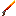

# Espada de Fogo (Fire Sword)



## Resumo

A Espada de Fogo e uma arma corpo-a-corpo com habilidades especiais de fogo. Ao ser segurada, emite particulas de chama e fumaca e **ilumina a area ao redor do jogador** com um `light_block` nivel 15 que acompanha seu movimento. Ao atingir mobs, aplica dano extra de fogo e os incendeia por 10 segundos. Ao atingir blocos de arvore (troncos, folhas, tabuas), tem 30% de chance de incendiar o bloco.

**NAO possui entidade projetil** — e uma arma de mao com efeitos via script.

---

## Dados do item

| Propriedade | Valor |
|-------------|-------|
| Identificador | `escavadora:espada_de_fogo` |
| Namespace | `escavadora` |
| Categoria no menu | Equipment > Sword |
| Stack maximo | 1 |
| Dano base | **8** (equivalente a espada de diamante) |
| Dano extra de fogo (via script) | **+4** por hit |
| Dano total por hit | **12** (8 base + 4 fogo) |
| Durabilidade | **2031** usos (equivalente a Netherite) |
| Encantavel | Sim (slot: sword, valor: 14) |
| Segurar na mao | Sim (`hand_equipped: true`) |
| Reparavel | Sim — 1 lingote de Netherite restaura 700 de durabilidade |
| Textura do item | `textures/items/espada_de_fogo` |
| Nome pt_BR | "Espada de Fogo" |
| Nome en_US | "Fire Sword" |

---

## Arquivo: item JSON completo

**Caminho:** `Super Picareta BP/items/espada_de_fogo.item.json`

```json
{
    "format_version": "1.21.10",
    "minecraft:item": {
        "description": {
            "identifier": "escavadora:espada_de_fogo",
            "menu_category": {
                "category": "equipment",
                "group": "itemGroup.name.sword"
            }
        },
        "components": {
            "minecraft:max_stack_size": 1,
            "minecraft:damage": 8,
            "minecraft:durability": {
                "max_durability": 2031
            },
            "minecraft:enchantable": {
                "slot": "sword",
                "value": 14
            },
            "minecraft:hand_equipped": true,
            "minecraft:icon": {
                "textures": {
                    "default": "espada_de_fogo"
                }
            },
            "minecraft:display_name": {
                "value": "item.escavadora:espada_de_fogo.name"
            },
            "minecraft:repairable": {
                "repair_items": [
                    {
                        "items": ["minecraft:netherite_ingot"],
                        "repair_amount": 700
                    }
                ]
            }
        }
    }
}
```

### Explicacao dos componentes

- **`minecraft:damage`: 8** — Dano base por hit (igual a espada de diamante). O script adiciona +4 de dano de fogo em cima disso.
- **`minecraft:durability`: 2031** — Mesma durabilidade da espada de Netherite vanilla.
- **`minecraft:enchantable`**: Slot `sword` com valor 14, permitindo encantamentos como Afiacao, Aspecto Flamejante, Repulsao, etc.
- **`minecraft:repairable`**: 1 lingote de Netherite numa bigorna restaura 700 pontos (~34% da durabilidade).
- **`minecraft:hand_equipped`**: Segura como espada na mao (inclinado).

> **Nota:** O componente `minecraft:damage` define o dano BASE do item. O dano extra de fogo (+4) e aplicado via script, nao via JSON. Isso significa que o dano de fogo ignora armadura parcialmente (causa: `"fire"`).

---

## Comportamento via Script

**Arquivo:** `Super Picareta BP/scripts/main.js` (linhas 979-1196)

A Espada de Fogo tem 4 sistemas independentes:
1. Iluminacao dinamica (segue o jogador)
2. Particulas visuais (chama + fumaca)
3. Dano de fogo em mobs
4. Incendio de arvores

---

### Constantes

```javascript
const FIRE_SWORD_ID = "escavadora:espada_de_fogo";
const FIRE_SWORD_LIGHT_LEVEL = 15;         // Nivel maximo de luz
const FIRE_SWORD_FIRE_DURATION = 10;       // Segundos que o mob queima
const FIRE_SWORD_EXTRA_DAMAGE = 4;         // Dano de fogo adicional por hit
const FIRE_SWORD_TREE_FIRE_CHANCE = 0.3;   // 30% de chance de incendiar arvore
```

### Estrutura de rastreamento

```javascript
const fireSwordPlayers = new Map(); // playerId -> { lights: {x,y,z}[], lastPos: {x,y,z} }
```

Rastreia cada jogador que esta segurando a espada: quais `light_block`s foram colocados e em que posicao o jogador estava na ultima verificacao.

---

### 1. Sistema de iluminacao dinamica

**Como funciona:**

O jogador que segura a Espada de Fogo e envolvido por uma luz invisivel que o acompanha. Tecnicamente, um `minecraft:light_block` nivel 15 (maximo) e colocado na posicao da cabeca do jogador (Y+1).

**Fluxo:**

```
Jogador pega a espada → placeFireSwordLight() → light_block colocado
        |
Jogador se move → detecta mudanca de bloco → remove luz antiga → coloca nova
        |
Jogador guarda a espada → remove luz → limpa rastreamento
        |
Jogador desconecta → remove luz → limpa rastreamento
```

**Detalhes da deteccao de movimento:**

- O monitor roda a cada **4 ticks** (`system.runInterval(..., 4)`)
- Compara posicao atual (arredondada para bloco) com `lastPos`
- Se X, Y OU Z mudaram → jogador trocou de bloco → reposicionar luz
- Se nao mudou → nao faz nada (performance)

**Funcao `placeFireSwordLight(dimension, playerLoc)`:**

1. Arredonda posicao do jogador para coordenadas de bloco
2. Tenta colocar `light_block` nivel 15 em `(x, y+1, z)` (nivel da cabeca)
3. So coloca se o bloco atual for `minecraft:air`
4. Retorna array de posicoes colocadas

> **Nota:** Light level 15 e o maximo do Minecraft. Um unico light_block nivel 15 ilumina ~15 blocos ao redor por propagacao natural da luz do jogo.

**Funcao `removeLightBlocks(dimension, lights)`:**

Reutiliza a mesma funcao da Pistola Sinalizadora. Remove cada `light_block` na lista substituindo por `minecraft:air`.

**Cleanup ao desconectar:**

```javascript
world.afterEvents.playerLeave.subscribe((event) => { ... });
```

Quando o jogador desconecta, o script:
1. Busca dados de rastreamento pelo `playerId`
2. Tenta remover os `light_block`s em TODAS as 3 dimensoes (pois nao sabe em qual o jogador estava)
3. Limpa o Map

---

### 2. Sistema de particulas visuais

**Quando:** Sempre que o jogador estiver segurando a espada (a cada 4 ticks).

**Particulas de chama (ao redor da mao):**

| Propriedade | Valor |
|-------------|-------|
| Particula | `minecraft:basic_flame_particle` |
| Quantidade | 3 por ciclo |
| Offset X/Z | Aleatorio -0.3 a +0.3 |
| Offset Y | 0.8 a 1.3 acima dos pes |

**Particulas de fumaca (subindo):**

| Propriedade | Valor |
|-------------|-------|
| Particula | `minecraft:campfire_tall_smoke_particle` |
| Quantidade | 3 por ciclo |
| Posicoes Y | Y+1.0, Y+1.8, Y+2.6 (3 pontos esoacados 0.8 cada) |
| Offset X/Z | Aleatorio -0.2 a +0.2 |

O efeito visual e de uma espada que emite chamas e fumaca constantemente enquanto empunhada.

---

### 3. Dano de fogo em mobs (`entityHitEntity`)

**Evento:** `world.afterEvents.entityHitEntity`

**Condicoes para ativar:**
1. O atacante deve ser `minecraft:player`
2. O atacante deve estar segurando a Espada de Fogo (slot selecionado)

**Efeitos ao atingir uma entidade:**

| Efeito | Valor | Detalhes |
|--------|-------|----------|
| Dano extra | **4** | Causa: `"fire"` (ignora parcialmente armadura) |
| Incendio | **10 segundos** | `setOnFire(10, true)` |

**Dano total por hit:** 8 (base do item) + 4 (script) = **12 de dano**

**Particulas no impacto:**

| Particula | Quantidade | Spread |
|-----------|------------|--------|
| `basic_flame_particle` | 8 | X/Z: -0.5 a +0.5, Y: 0 a 1.5 |
| `lava_particle` | 3 | X/Z: -0.25 a +0.25, Y: 0.5 a 1.0 |

O efeito visual e uma explosao de chamas e particulas de lava no ponto de impacto.

**Funcao `isHoldingFireSword(player)`:**

Verifica se o jogador esta segurando a espada:
1. Acessa `player.getComponent("minecraft:inventory")`
2. Obtem o container do inventario
3. Le o item no `selectedSlotIndex` (slot da hotbar selecionado)
4. Compara `item.typeId` com `FIRE_SWORD_ID`

---

### 4. Incendio de arvores (`entityHitBlock`)

**Evento:** `world.afterEvents.entityHitBlock`

**Condicoes para ativar:**
1. O atacante deve ser `minecraft:player`
2. O atacante deve estar segurando a Espada de Fogo
3. O bloco atingido deve ser um bloco de arvore
4. Random < 0.3 (**30% de chance**)

**Funcao `isTreeBlock(blockTypeId)`:**

Retorna `true` se o nome do bloco contem:
- `"log"` — Troncos (oak_log, birch_log, spruce_log, etc.)
- `"wood"` — Madeira descascada (stripped_oak_wood, etc.)
- `"leaves"` — Folhas (oak_leaves, birch_leaves, etc.)
- `"stem"` — Caules do Nether (crimson_stem, warped_stem)
- `"hyphae"` — Hifas do Nether (crimson_hyphae, warped_hyphae)
- `"planks"` — Tabuas (oak_planks, birch_planks, etc.)

**Efeito quando ativa:**
1. Pega o bloco acima do bloco atingido (`y + 1`)
2. Se for `minecraft:air`, substitui por `minecraft:fire`
3. Spawna 5 particulas `basic_flame_particle` ao redor do bloco

> **Nota:** O fogo so e colocado se houver um bloco de ar acima. Se o bloco de cima for solido, nao acontece nada.

---

### Funcao `isHoldingFireSword` — detalhes

```javascript
function isHoldingFireSword(player) {
    try {
        const inventory = player.getComponent("minecraft:inventory");
        if (!inventory) return false;
        const container = inventory.container;
        if (!container) return false;
        const item = container.getItem(player.selectedSlotIndex);
        if (!item) return false;
        return item.typeId === FIRE_SWORD_ID;
    } catch (e) {
        return false;
    }
}
```

Esta funcao e chamada em 3 lugares:
1. No loop principal (a cada 4 ticks) — para particulas e iluminacao
2. No evento `entityHitEntity` — para dano de fogo
3. No evento `entityHitBlock` — para incendio de arvore

---

## Constantes numericas completas

```
=== ITEM ===
Dano base (JSON):              8
Dano extra fogo (script):      4
Dano total por hit:            12
Durabilidade:                  2031
Reparo (netherite_ingot):      700 por lingote
Encantamento slot:             sword (valor 14)
Stack maximo:                  1

=== ILUMINACAO ===
Light block level:             15 (maximo)
Posicao da luz:                Y+1 (cabeca do jogador)
Quantidade de light_blocks:    1 por jogador
Raio de iluminacao efetivo:    ~15 blocos (propagacao natural)
Monitor interval:              4 ticks
Deteccao de movimento:         Por mudanca de coordenada de bloco

=== PARTICULAS (segurando) ===
Chama por ciclo:               3 particulas basic_flame_particle
Chama offset Y:                0.8 a 1.3 (altura da mao)
Chama spread X/Z:              0.6 total
Fumaca por ciclo:              3 particulas campfire_tall_smoke_particle
Fumaca posicoes Y:             +1.0, +1.8, +2.6
Fumaca spread X/Z:             0.4 total
Frequencia:                    A cada 4 ticks

=== HIT EM MOB ===
Dano extra:                    4 (causa: "fire")
Duracao do fogo no mob:        10 segundos
Particulas chama:              8 basic_flame_particle (spread 1.0)
Particulas lava:               3 lava_particle (spread 0.5)

=== HIT EM ARVORE ===
Chance de fogo:                30% (0.3)
Blocos afetados:               log, wood, leaves, stem, hyphae, planks
Posicao do fogo:               1 bloco acima do bloco atingido
Condicao:                      Bloco acima deve ser air
Particulas:                    5 basic_flame_particle
```

---

## Comparacao com espadas vanilla

| Propriedade | Espada de Fogo | Netherite Sword | Diamond Sword |
|-------------|---------------|-----------------|---------------|
| Dano base | 8 | 8 | 7 |
| Dano extra (script) | +4 fogo | — | — |
| **Dano total** | **12** | **8** | **7** |
| Durabilidade | 2031 | 2031 | 1561 |
| Incendeia mobs | Sim (10s) | Nao | Nao |
| Ilumina area | Sim (nivel 15) | Nao | Nao |
| Incendeia arvores | Sim (30%) | Nao | Nao |
| Particulas visuais | Sim (chama+fumaca) | Nao | Nao |
| Reparo | Netherite ingot | Netherite ingot | Diamante |
| Encantavel | Sim | Sim | Sim |

---

## Arquivos relacionados

| Arquivo | Funcao |
|---------|--------|
| `Super Picareta BP/items/espada_de_fogo.item.json` | Definicao do item |
| `Super Picareta BP/scripts/main.js` (L979-1196) | Toda a logica da espada |
| `Super Picareta RP/textures/items/espada_de_fogo.png` | Textura do item no inventario |
| `Super Picareta RP/textures/item_texture.json` | Mapeamento de textura (entrada `espada_de_fogo`) |
| `Super Picareta RP/texts/pt_BR.lang` | Nome: "Espada de Fogo" |
| `Super Picareta RP/texts/en_US.lang` | Nome: "Fire Sword" |

> **Nota:** A Espada de Fogo NAO tem entidade projetil, modelo 3D customizado, animacao, render controller ou attachable. Usa a aparencia padrao de item flat (textura 2D no inventario e na mao). Todo o visual especial (chamas, fumaca, iluminacao) e feito via particulas e light_blocks pelo script.

---

## Comando para obter

```
/give @s escavadora:espada_de_fogo
```
